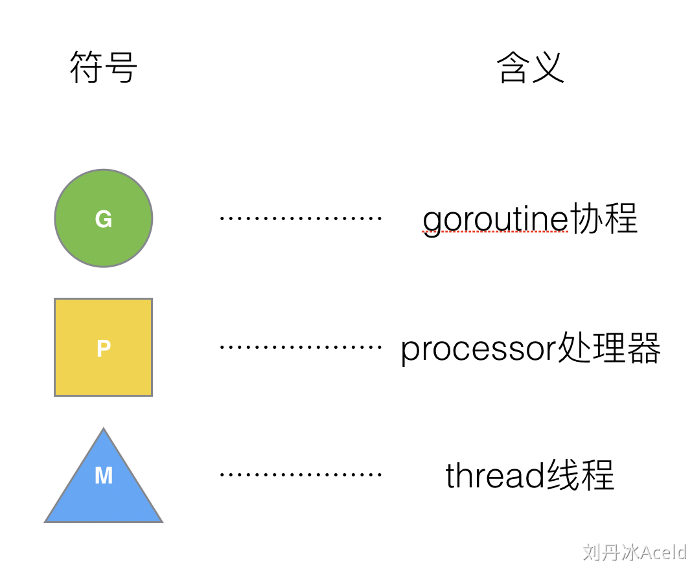
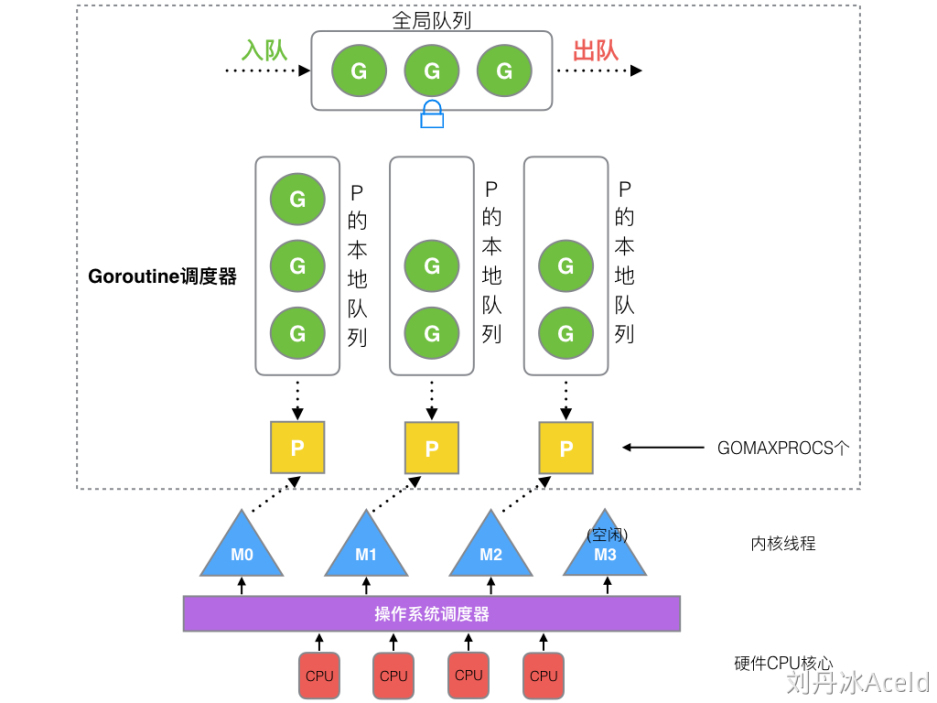
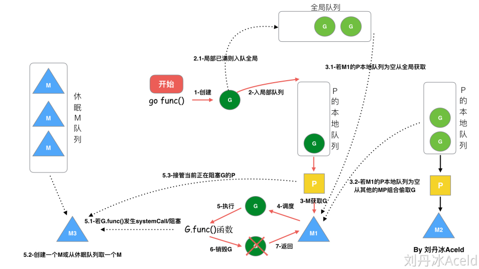

## 不要通过共享内存来通信，要通过通信来共享内存


### 一、Goroutine调度器的GMP模型的设计思想

面对之前调度器的问题，Go设计了新的调度器。

在新调度器中，除了**M(thread)**和**G(goroutine)**，又引进了**P(Processor)**。



**Processor，它包含了运行goroutine的资源**，如果线程想运行goroutine，必须先获取P，P中还包含了可运行的G队列。

#### (1) GMP模型

在Go中，**线程是运行goroutine的实体，调度器的功能是把可运行的goroutine分配到工作线程上**。



1. **全局队列**（Global Queue）：存放等待运行的G。

2. **P的本地队列**：同全局队列类似，存放的也是等待运行的G，存的数量有限，不超过256个。新建G'时，G'优先加入到P的本地队列，如果队列满了，则会把本地队列中一半的G移动到全局队列。

3. **P列表**：所有的P都在程序启动时创建，并保存在数组中，最多有`GOMAXPROCS`(可配置)个。

4. **M**：线程想运行任务就得获取P，从P的本地队列获取G，P队列为空时，M也会尝试从全局队列**拿**一批G放到P的本地队列，或从其他P的本地队列**偷**一半放到自己P的本地队列。M运行G，G执行之后，M会从P获取下一个G，不断重复下去。

   

**Goroutine调度器和OS调度器是通过M结合起来的，每个M都代表了1个内核线程，OS调度器负责把内核线程分配到CPU的核上执行**。

#### 有关P和M的个数问题

1、P的数量：

- 由启动时环境变量`$GOMAXPROCS`或者是由`runtime`的方法`GOMAXPROCS()`决定。这意味着在程序执行的任意时刻都只有`$GOMAXPROCS`个goroutine在同时运行。


2、M的数量:

- go语言本身的限制：go程序启动时，会设置M的最大数量，默认10000.但是内核很难支持这么多的线程数，所以这个限制可以忽略。
- runtime/debug中的SetMaxThreads函数，设置M的最大数量
- 一个M阻塞了，会创建新的M。

M与P的数量没有绝对关系，一个M阻塞，P就会去创建或者切换另一个M，所以，即使P的默认数量是1，也有可能会创建很多个M出来。


#### P和M何时会被创建

1、P何时创建：在确定了P的最大数量n后，运行时系统会根据这个数量创建n个P。


2、M何时创建：没有足够的M来关联P并运行其中的可运行的G。比如所有的M此时都阻塞住了，而P中还有很多就绪任务，就会去寻找空闲的M，而没有空闲的，就会去创建新的M。


### (2) 调度器的设计策略

**复用线程**：避免频繁的创建、销毁线程，而是对线程的复用。

1）work stealing机制

​		当本线程无可运行的G时，尝试从其他线程绑定的P偷取G，而不是销毁线程。

2）hand off机制

​		当本线程因为G进行系统调用阻塞时，线程释放绑定的P，把P转移给其他空闲的线程执行。

**利用并行**：`GOMAXPROCS`设置P的数量，最多有`GOMAXPROCS`个线程分布在多个CPU上同时运行。`GOMAXPROCS`也限制了并发的程度，比如`GOMAXPROCS = 核数/2`，则最多利用了一半的CPU核进行并行。


**抢占**：在coroutine中要等待一个协程主动让出CPU才执行下一个协程，在Go中，一个goroutine最多占用CPU 10ms，防止其他goroutine被饿死，这就是goroutine不同于coroutine的一个地方。


**全局G队列**：在新的调度器中依然有全局G队列，当P的本地队列为空时，优先从全局队列获取，如果全局队列为空时则通过work stealing机制从其他P的本地队列偷取G。

### (3) go func()  调度流程



从上图我们可以分析出几个结论：

​	1、我们通过 go func()来创建一个goroutine；


​	2、有两个存储G的队列，一个是局部调度器P的本地队列、一个是全局G队列。新创建的G会先保存在P的本地队列中，如果P的本地队列已经满了就会保存在全局的队列中；


​	3、G只能运行在M中，一个M必须持有一个P，M与P是1：1的关系。M会从P的本地队列弹出一个可执行状态的G来执行，如果P的本地队列为空，就会想其他的MP组合偷取一个可执行的G来执行；


​	4、一个M调度G执行的过程是一个循环机制；


​	5、当M执行某一个G时候如果发生了syscall或则其余阻塞操作，M会阻塞，如果当前有一些G在执行，runtime会把这个线程M从P中摘除(detach)，然后再创建一个新的操作系统的线程(如果有空闲的线程可用就复用空闲线程)来服务于这个P；


​	6、当M系统调用结束时候，这个G会尝试获取一个空闲的P执行，并放入到这个P的本地队列。如果获取不到P，那么这个线程M变成休眠状态， 加入到空闲线程中，然后这个G会被放入全局队列中。

### (4) 调度器的生命周期


特殊的M0和G0

**M0**

`M0`是启动程序后的编号为0的主线程，这个M对应的实例会在全局变量runtime.m0中，不需要在heap上分配，M0负责执行初始化操作和启动第一个G， 在之后M0就和其他的M一样了。


**G0**

`G0`是每次启动一个M都会第一个创建的gourtine，G0仅用于负责调度的G，G0不指向任何可执行的函数, 每个M都会有一个自己的G0。在调度或系统调用时会使用G0的栈空间, 全局变量的G0是M0的G0。


我们来跟踪一段代码

```golang
package main

import "fmt"

func main() {
    fmt.Println("Hello world")
}
```

接下来我们来针对上面的代码对调度器里面的结构做一个分析。

也会经历如上图所示的过程：

1. runtime创建最初的线程m0和goroutine g0，并把2者关联。
2. 调度器初始化：初始化m0、栈、垃圾回收，以及创建和初始化由GOMAXPROCS个P构成的P列表。
3. 示例代码中的main函数是`main.main`，`runtime`中也有1个main函数——`runtime.main`，代码经过编译后，`runtime.main`会调用`main.main`，程序启动时会为`runtime.main`创建goroutine，称它为main goroutine吧，然后把main goroutine加入到P的本地队列。
4. 启动m0，m0已经绑定了P，会从P的本地队列获取G，获取到main goroutine。
5. G拥有栈，M根据G中的栈信息和调度信息设置运行环境
6. M运行G
7. G退出，再次回到M获取可运行的G，这样重复下去，直到`main.main`退出，`runtime.main`执行Defer和Panic处理，或调用`runtime.exit`退出程序。


调度器的生命周期几乎占满了一个Go程序的一生，`runtime.main`的goroutine执行之前都是为调度器做准备工作，`runtime.main`的goroutine运行，才是调度器的真正开始，直到`runtime.main`结束而结束。


文章出处：https://www.yuque.com/aceld/golang/srxd6d


